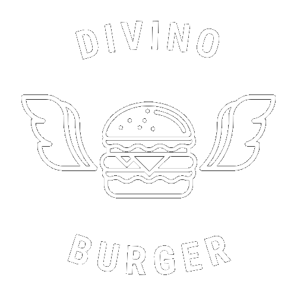

<h1 align="center"> Divino Burger - API com Node.js :hamburger:</h1>

<div align="center" style="display: flex">
  
</div>

## Projeto 5 - Burger Queen API desenvolvido no bootcamp de Front-End da SAP006 Laboratória :yellow_heart:

## Índice
1. [Apresentação](#briefcase-apresentação)
2. [Resumo do Projeto](#clipboard-resumo-do-projeto)
3. [Endpoints da API Divino Burger](#gear-endpoints-da-API-Divino-Burger)
4. [Estrutura do Banco de Dados](#bar_chart-estrutura-do-banco-de-dados)
5. [Tecnologias Utilizadas](#robot-tecnologias-utilizadas)
6. [Estrutura dos Principais Arquivos](#file_folder-estrutura-dos-principais-arquivos)
7. [Resultados](#%EF%B8%8F-resultados)
8. [Sobre a Desenvolvedora](#woman_technologist-sobre-a-desenvolvedora)

---
## :briefcase: Apresentação

Um pequeno restaurante de hambúrgueres, em crescimento, necessitava de um sistema para realizar pedidos usando um _tablet_, e que os enviem à cozinha para que sejam preparados de forma ordenada e eficiente.

A interface front-end da aplicação Divino Burger já foi criada, [acesse aqui](https://divinoburger.vercel.app/) para conhecer.

E agora foi criado o back-end para manejar os dados dessa aplicação. Feito através de uma _API rest_ que é compatível com as requisições vindas do front. [Aqui](https://divino-burger-api-rest.herokuapp.com/) você consegue acessar API.

---

## :clipboard: Resumo do Projeto

Como back-end, nesse caso nos referimos a um _servidor web_, que é basicamente um programa que _ouve_ o que acontece na aplicação através de uma porta de rede,
pela qual podemos enviar _requisições_ (_requests_) e obter _respostas_ (_responses_). Um servidor web deve _manejar_ as requisições que chegam e devolver respostas a elas,
que serão enviadas de volta ao _cliente_. Quando falamos de _aplicações de servidor_, isso implica uma arquitetura de _cliente/servidor_, onde o cliente é um programa
que faz requisições através de uma rede (por exemplo o navegador, o cURL, etc) e o servidor é o programa que recebe essas requisições e as responde.

---

## :gear: Endpoints da API Divino Burger

#### :woman_cook: `/users`

* `GET /users`
* `GET /users/:user_id`
* `POST /users`
* `PUT /users/:user_id`
* `DELETE /users/:user_id`

#### :fries: `/products`

* `GET /products`
* `GET /products/:product_id`
* `POST /products`
* `PUT /products/:product_id`
* `DELETE /products/:product_id`

#### :page_with_curl: `/orders`

* `GET /orders`
* `GET /orders/:order_id`
* `POST /orders`
* `PUT /orders/:order_id`
* `DELETE /orders/:order_id`

---

## :bar_chart: Estrutura do Banco de Dados
<div align="center" style="display: flex">
  
</div>

---

## :robot: Tecnologias Utilizadas

| Ferramenta | Descrição |
| --- | --- |
| `Node.js` | Software de execução de códigos JavaScript |
| `Express` | Framework para Node.js que fornece recursos mínimos para construção de servidores web |
| `Sequelize` | Sequelize é um ORM(Object-Relational Mapper) para Node.js baseado em promise, utilizado para bancos de dados, como Postgres, entre outros |
| `PostgreSQL` |  Sistema gerenciador de banco de dados objeto relacional (SGBD), desenvolvido como projeto de código aberto |
| `Heroku` | Plataforma de serviço (PaaS) que permite a contrução, execução e operação de aplicativos inteiramente na nuvem |
| `Dbeaver` | Aplicativo de software cliente SQL e uma ferramenta de administração de banco de dados |
| `Postman` | API Client que facilita a criação, compartilhamento, testes e documentação de APIs |
| `Git e GitHub` | Sistemas de controle de versões distribuídos |

---

## :file_folder: Estrutura dos Principais Arquivos
```
.
├── 📁public
|
├── 📁src
|   ├── 📁components
|   |   ├── 📁All-day
|   |   ├── 📁Breakfast
|   |   ├── 📁ButtonDefault
|   |   ├── 📁ButtonImg
|   |   ├── 📁ButtonRadio
|   |   ├── 📁ButtonSelect
|   |   ├── 📁CarArea
|   |   ├── 📁CartItem
|   |   ├── 📁DateTime
|   |   ├── 📁ErrorMessage
|   |   ├── 📁Header
|   |   ├── 📁Input
|   |   ├── 📁LinkAside
|   |   ├── 📁ListAllOrders
|   |   ├── 📁Loader
|   |   ├── 📁NotFound
|   |   ├── 📁Popup
|   |   ├── 📁PopupCancel
|   |   └── 📁ProductArea
|   |
|   ├── 📁img
|   |
|   ├── 📁pages
|   |   ├── 📁Hall
|   |   ├── 📁Login
|   |   ├── 📁OrdersPanel
|   |   └── 📁Register
|   |
|   ├── 📁services
|   |   
|   ├── 📁utils
|   |
|   ├── 📄global.scss
|   ├── 📄index.js
|   └── 📄routes.js
|   
├── 📄README.md
└── 📄package.json

```

---

## ✔️ Resultados

* #### Tablet
<div style="display: flex" align="center">
  <br><br>
  <br><br>
  <br><br>
  
</div>

* #### Responsivo


---
## :woman_technologist: Sobre a Desenvolvedora

### Karen Freitas

- [LinkedIn](https://www.linkedin.com/in/karen-freitas/)
- E-mail: karenfcorrea@gmail.com
### Patrícia Barnabé

- [LinkedIn](https://www.linkedin.com/in/patriciabarnabe)
- E-mail: patbarnabe5@gmail.com


